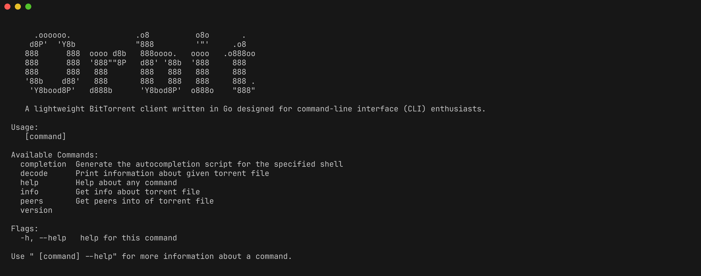

# Orbit

Orbit is a lightweight BitTorrent client written in Go, crafted specifically for command-line interface (CLI) enthusiasts. With a focus on simplicity and performance, Orbit provides essential torrenting features in a compact, user-friendly package.



## Features

- Fast and efficient torrent downloading
- Minimalistic CLI interface
- Lightweight and portable
- Written in Go for cross-platform compatibility

## Installation

1. Clone the repository:

   ```bash
   git clone https://github.com/subroto/orbit-torrent.git
   cd orbit
   ```

2. Build the client:

   ```bash
   go build -o orbit ./cmd/main.go
   ```

3. Run Orbit:

   ```bash
   ./orbit
   ```